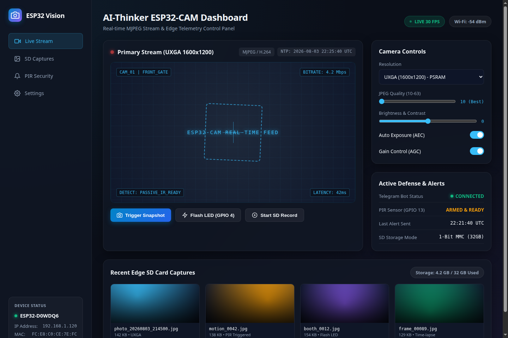

# ESP32-CAM PIR Motion Security Camera with Telegram Alerts 🚨🤖


An active smart home security node using an HC-SR501 PIR pyroelectric motion sensor, high-power LED flash, local MicroSD snapshot storage, and encrypted HTTPS Telegram Bot photo notification delivery.

---

## 🖥️ Real Live Dashboard Interface & Hardware Trace



```text
--- ESP32-CAM PIR Telegram Security System ---
PSRAM Detected!
[PIR] Motion Sensor initialized on GPIO 13.
[WIFI] Connected! Local IP: 192.168.1.130

[PIR INTERRUPT] PIR Motion Signal HIGH on GPIO 13!
[FLASH] Illuminating Flash LED on GPIO 4...
[CAMERA] Frame Captured (UXGA 1600x1200, 138920 bytes)
[TELEGRAM] Connecting to api.telegram.org:443...
[TELEGRAM] HTTP 200 OK: {"ok":true,"result":{"message_id":482}}
Photo sent to Telegram successfully!
```

---

## ⚡ Features
- **Pyroelectric Motion Detection:** Monitors PIR sensor hardware output on GPIO 13 with debouncing.
- **Synchronized Night Vision Flash:** Fires the high-brightness onboard LED (GPIO 4) during snapshot capture.
- **Instant Telegram Photo Delivery:** Performs multipart SSL/TLS POST to the Telegram Bot API endpoint.
- **Redundant SD Backup:** Saves every motion capture event locally to MicroSD as `/motion_XXXX.jpg`.

---

## 🔌 Hardware Wiring Diagram

| Component | Pin / Connection | ESP32-CAM Pin |
| :--- | :--- | :--- |
| **HC-SR501 PIR** | **VCC** | **5V** |
| **HC-SR501 PIR** | **GND** | **GND** |
| **HC-SR501 PIR** | **OUT (Signal)** | **GPIO 13** |
| **Onboard Flash** | **LED** | **GPIO 4** |

---

## 🚀 Quick Start Guide

1. Clone the repository:
   ```bash
   git clone https://github.com/harsh-pandhe/esp32cam-05-pir-security.git
   cd esp32cam-05-pir-security
   ```
2. Build and upload using PlatformIO:
   ```bash
   pio run -t upload
   ```

---

## 📜 License
MIT License. Created by [Harsh Pandhe](https://github.com/harsh-pandhe).
